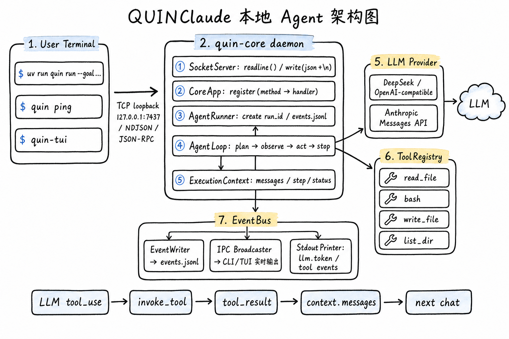

# QuinClaude

QuinClaude 是一个**本地运行的编码 Agent**：用户在终端下发目标，`quin-core` 常驻进程通过 TCP loopback（NDJSON / JSON-RPC 2.0）接收指令，驱动 `plan → observe → act → stop` 的 Agent Loop，调用 LLM 与内置工具（read_file / bash / write_file / list_dir 等）完成任务，并通过 EventBus 把执行事件实时回传给 CLI / TUI。支持 DeepSeek / OpenAI 兼容接口与 Anthropic Messages API，内置权限管控、会话管理、上下文压缩与 MCP 工具接入。

采用**双进程**架构：`quin-core` 是常驻 daemon，`quin`（CLI）与 `quin-tui`（终端 UI，主要前端）作为客户端通过 `127.0.0.1:7437` 与其通信。

## 架构



## 测试用例与自动化测试

项目采用 **pytest**（`asyncio_mode = auto`，自动管理异步事件循环）构建了完整的自动化测试体系，共 **273 个用例**，覆盖单元测试与集成测试两层：

- **单元测试（`tests/unit/`，262 例，全部通过）**——按模块粒度隔离验证核心组件：工具注册与调用/重试（tool registry、invocation、retry）、内置工具（bash / read_file / write_file / note_save / task_*）、权限策略与管理器（permission policy / manager）、会话与存储（session manager / store）、上下文与压缩预算（context / compactor / budget）、事件总线与写入器（event bus / writer / stdout printer / ipc broadcaster）、LLM Provider、Socket 客户端/服务端、MCP 工具，以及 TUI 应用。用例普遍采用 **Mock LLM Provider** 与临时目录 fixture，无需真实网络与 API Key 即可离线运行。
- **集成测试（`tests/integration/`，11 例）**——端到端串联真实链路：`test_ping_roundtrip` 验证 CLI↔daemon 探活往返；`test_s2_dual_process` 拉起真实 daemon 子进程做双进程通信；`test_s4_session_ipc` 验证会话级 IPC 广播；`test_s5_permission_flow` 用 in-process `AgentRunner` + 真实 `PermissionManager` 走完权限审批流；`test_run_e2e` 覆盖完整运行闭环。其中 10 例使用 Mock Provider 可离线运行，1 例标记 `@pytest.mark.integration`，需配置真实 API Key 才会执行。
- **测试基建**——`tests/conftest.py` 提供 `free_port`（分配空闲端口）与 `running_daemon`（自动拉起并回收 daemon 子进程）等共享 fixture，保证集成测试的进程隔离与可重复性；每个测试函数都遵循「功能 + 设计」两行中文注释规范，让读者既能快速判断测试意图，又能理解断言背后的取舍。

### 运行测试

```bash
make test              # 单元测试        → uv run pytest tests/unit -v
make integration-test  # 集成测试        → uv run pytest tests/integration -v
make lint              # ruff + mypy 严格类型检查
make verify-s0         # 一键校验：sync + lint + 单测 + ping 集成 + 协议文档
```
